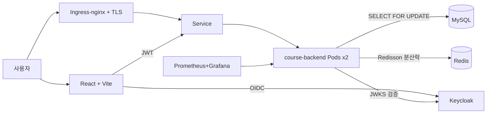

# 수강신청 시스템 — DevOps 포트폴리오


> 수강신청 폭주 상황에서 **오버부킹 0 · 무중단**을 보장하는 백엔드를
> **"Local-First, Cloud-Ready"** 전략으로 구축한 1인 DevOps 프로젝트.
> 로컬(Docker Compose · minikube · Keycloak)에서 전부 검증하고, 동일 구조를 Terraform으로 작성해 `terraform apply`로 AWS 전개.

## 📌 핵심 성과
- **동시성**: 부하 100명 → 정원 30 강의에서 **성공 30 / 정원마감 70 / 오버부킹 0** 실측 (k6)
- **가용성**: Pod 강제 종료에도 **무중단(50/50)** + 자동 재생성, DB/Redis 재시작 시 커넥션풀·분산락 **자동 복구**
- **자동화**: GitHub Actions CI(test+build) → 이미지 push → K8s 롤아웃, GitHub OIDC→IAM 키리스 인증
- **관측성**: kube-prometheus-stack(Prometheus+Grafana) + Spring Actuator 메트릭

## 🏗️ 아키텍처 (로컬)

> 로컬 vs AWS 전체 구성·설계 근거는 **[docs/architecture.md](docs/architecture.md)** 참고.

## 🧰 기술 스택
| 영역 | 기술 |
|------|------|
| Backend | Spring Boot 4.1 · Java 17 · Flyway · HikariCP · Micrometer |
| 동시성 | DB 비관적락(SELECT FOR UPDATE) · Redis 분산락(Redisson) |
| Frontend | React · Vite · nginx |
| 인증 | Keycloak(OIDC, 로컬) ↔ Cognito(AWS) |
| 오케스트레이션 | Kubernetes(minikube) · Kustomize(base/overlays) · HPA · PDB |
| 모니터링 | kube-prometheus-stack · Grafana · Actuator |
| CI/CD | GitHub Actions · Docker Hub/ECR · GitHub OIDC→IAM |
| IaC | Terraform(vpc·iam·rds·elasticache·eks·cognito·s3-cloudfront 등) |
| 부하테스트 | k6 |

## 🎬 데모 & 스크린샷
> 캡쳐 이미지는 `docs/img/` 에 넣고 아래 경로에 맞추면 표시됩니다.

| 시간표 UI | k6 통합 부하 (30/30) | Pod 장애 복구 |
|---|---|---|
|  |  |  |

| Grafana 대시보드 | 아키텍처 다이어그램 |
|---|---|
|  |  |

## 🚀 로컬 실행 가이드
**사전 요구**: Docker, minikube, kubectl, Node 18+

```bash
# 1) 인프라 기동 (MySQL 3306 · Redis 6379 · Keycloak 8180)
cd infra/docker-compose
docker compose up -d
bash keycloak-setup.sh          # course realm/client/user 생성

# 2) 쿠버네티스 배포 (백엔드)
minikube start --driver=docker
bash k8s/gen-tls-secret.sh      # self-signed TLS 시크릿(선택)
kubectl apply -k k8s/overlays/local
kubectl get pods -l app=course-backend   # Running 확인

# 3) 백엔드 접속 (NodePort 권장 — pod 재생성에도 안 끊김)
echo "http://$(minikube ip):$(kubectl get svc course-backend -o jsonpath='{.spec.ports[0].nodePort}')"

# 4) 프론트 실행
cd frontend
cp .env.example .env            # Keycloak/API 주소 확인
npm install && npm run dev      # http://localhost:5173
```
> AWS 전개: `k8s/overlays/aws` 오버레이 + `infra/terraform` 모듈(`terraform apply`).

## 🔧 트러블슈팅
| 증상 | 원인 | 해결 |
|------|------|------|
| 수강신청 언더부킹(7/30) | 분산락 WAIT_TIME 3초로 유효 요청까지 빠르게 튕김 | 클라이언트 재시도 반영 → 30/30 충족, 오버부킹 0 유지 |
| 로그인 401 | 토큰 iss(localhost) ≠ 백엔드 기대(host.minikube.internal) | 프론트·백엔드 Keycloak issuer 주소 통일 |
| 강의목록 미표시 | port-forward가 물린 pod 종료로 터널 끊김 | NodePort 경유(kube-proxy 로드밸런싱)로 접속 |
| WSL read-only 전환 | 호스트 디스크 고갈 | 불필요 VM·이미지 정리로 공간 확보 |
| TLS 인증서가 가짜로 보임 | `curl -H Host`는 TLS SNI 미전송 | `--resolve`로 SNI 포함 → 실제 CN 확인(설정 문제 아님) |

## 💡 배운 점
- 로컬(minikube+compose)만으로 **실전급 DevOps 전 과정**(K8s·IaC·CI/CD·모니터링·부하/장애테스트)을 검증할 수 있다.
- 락 튜닝은 **트레이드오프** — 빠른 실패(꼬리지연↓) vs 정원 충족률. 값은 튜너블하게 두는 게 정답.
- 문제는 "느낌"이 아니라 **부하·메트릭으로 측정**해야 드러난다(언더부킹 발견).
- IaC로 **재현 가능한 인프라**를 코드로 남기는 것의 가치.

## 📄 관련 문서
- [아키텍처 & 설계 근거](docs/architecture.md)
- [E2E 리허설 결과](docs/m10-rehearsal.md)
- [통합 부하 테스트](docs/m9-integration-test.md) · [장애 복구 테스트](docs/m9-resilience-test.md)
- [발표자료 (PDF)](docs/수강신청시스템_발표자료.pdf)
- [K8s 매니페스트 가이드](k8s/README.md)
