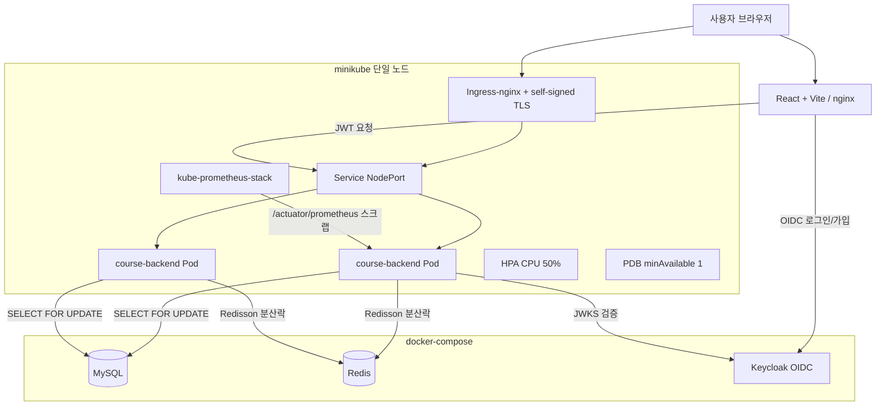
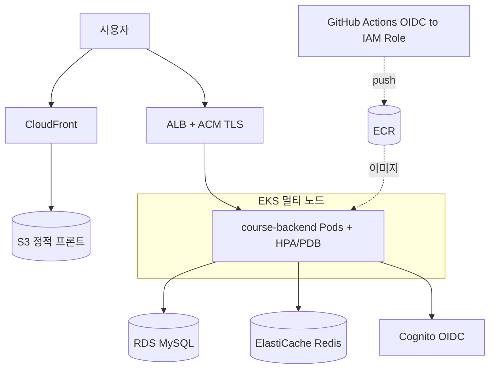

# 아키텍처 & 설계 근거 (수강신청 시스템)

## 1. 프로젝트 목표와 전략
대규모 트래픽(수강신청 폭주)을 안전하게 처리하는 백엔드를, **"Local-First, Cloud-Ready"** 전략으로 구축.
- **Local-First**: 모든 걸 로컬(Docker Compose · minikube · Keycloak)에서 실제로 돌려 검증
- **Cloud-Ready**: 동일 구조를 Terraform 코드로 작성 → `terraform apply` 시 AWS로 그대로 전개
- 비용 0으로 실전급 DevOps(K8s·IaC·CI/CD·모니터링·부하/장애테스트)를 end-to-end로 경험하는 게 목적

## 2. 전체 아키텍처

### 2-1. 로컬 구성 (현재 동작 중)

### 2-2. AWS 목표 구성 (Terraform으로 전개)

## 3. 기술 선택 근거

**왜 minikube?**
로컬에서 진짜 K8s API(Deployment/Service/HPA/PDB/Ingress)를 그대로 쓰기 위해. EKS는 시간당 과금이라 학습·반복에 부담. minikube로 매니페스트를 완성하고, Kustomize overlay만 바꿔 EKS로 이식.

**왜 Keycloak? (그리고 Cognito)**
인증을 백엔드에서 분리(offload)하려고. 백엔드는 JWT 검증만 담당하고, 회원가입·로그인·토큰발급은 IdP가 처리. 로컬은 오픈소스 Keycloak(OIDC 표준), AWS는 관리형 Cognito — **둘 다 OIDC 표준**이라 백엔드 코드는 issuer/JWKS 주소만 바꾸면 그대로 동작.

**왜 Kustomize?**
같은 base 매니페스트를 두고 환경별 차이(local: NodePort / aws: LoadBalancer+ALB, replicas, 어노테이션)만 overlay로 패치. Helm보다 단순하고, "로컬과 AWS가 같은 뼈대"라는 전략에 정확히 맞음.

**왜 Redisson 분산락 + DB 비관적락(이중)?**
- DB `SELECT FOR UPDATE`(비관적락)가 **최종 방어선** — 오버부킹 원천 차단
- Redisson 분산락은 그 앞단에서 **같은 강의 요청을 줄 세워** DB 경합·부하를 줄임
- 부하테스트(M9)로 이중 구조가 오버부킹 0을 보장함을 실측

**왜 kube-prometheus-stack?**
Prometheus + Grafana + exporter를 Helm 한 번으로. Spring Actuator(`/actuator/prometheus`)를 ServiceMonitor로 스크랩 → 표준 관측성 스택을 로컬에서 그대로 학습.

**왜 Terraform 모듈화?**
vpc/sg/iam/ecr/rds/elasticache/eks/cognito/s3-cloudfront 등을 모듈로 분리 → 재사용·가독성·리뷰 용이. tfstate는 원격 백엔드로 관리(모듈 분리).

## 4. 로컬 → AWS 전환 매핑
| 역할 | 로컬 | AWS | 전환 방식 |
|------|------|-----|-----------|
| 오케스트레이션 | minikube | EKS | Kustomize overlay(aws) |
| DB | docker-compose MySQL | RDS | env(호스트) 교체 |
| 캐시/락 | docker-compose Redis | ElastiCache | env(호스트) 교체 |
| 인증 | Keycloak | Cognito | OIDC issuer/JWKS 교체 |
| 이미지 레지스트리 | Docker Hub | ECR | CI push 대상 변경 |
| 외부 노출 | Ingress-nginx + self-signed | ALB + ACM | ingressClassName/어노테이션 |
| 정적 프론트 | Vite/nginx | S3 + CloudFront | 빌드 산출물 배포 |
| CI 권한 | Docker Hub secret | GitHub OIDC to IAM Role | 키리스 인증 |

핵심: **애플리케이션 코드는 거의 그대로**, 바뀌는 건 대부분 "주소(env)와 인프라 매니페스트"뿐. 이게 Cloud-Ready 설계의 목표.

## 5. 트레이드오프 분석
| 결정 | 장점 | 비용/한계 | 판단 |
|------|------|-----------|------|
| Local-First(minikube) | 비용 0, 빠른 반복, 실 K8s 학습 | 단일노드→진짜 멀티노드 재배치 미검증(M9-4) | 학습 목적엔 최적, 멀티노드는 EKS 경로로 명시 |
| DB락 + Redis락 이중 | 오버부킹 0 + DB 부하 완화 | 구현 복잡도↑, 락 대기 튜닝 필요 | 정합성이 최우선인 수강신청엔 타당 |
| 락 WAIT_TIME 3초(빠른 실패) | 폭주 시 DB 보호, 꼬리지연↓ | 재시도 없으면 언더부킹(M9-3서 7/30) | 클라이언트 재시도 전제로 채택, 값은 튜너블 |
| Keycloak/Cognito 분리 | 백엔드 단순화, 표준 OIDC | IdP 운영 포인트 추가 | 인증 오프로드 이점이 큼 |
| Kustomize(vs Helm) | 단순, base 공유 | 템플릿 로직 약함 | 환경차가 작아 적합 |
| self-signed TLS(로컬) | 무료로 HTTPS 흐름 검증 | 브라우저 신뢰 안 됨 | 로컬 검증용, 운영은 ACM |

## 6. 신뢰성 설계 요약
- **가용성**: replica 2 + PDB(min 1) + HPA(2~10, CPU 50%) + probe(startup/liveness/readiness)
- **동시성**: DB 비관적락(정합성) + Redisson 분산락(경합 완화), 부하테스트로 오버부킹 0 실측
- **자가복구(M9-4)**: Pod kill→자동 재생성(무중단), DB/Redis 재시작→커넥션풀·분산락 자동 재연결
- **관측성**: Actuator + Prometheus + Grafana, ServiceMonitor 스크랩
- **배포**: GitHub Actions CI(test+build) → 이미지 push → K8s 롤아웃
