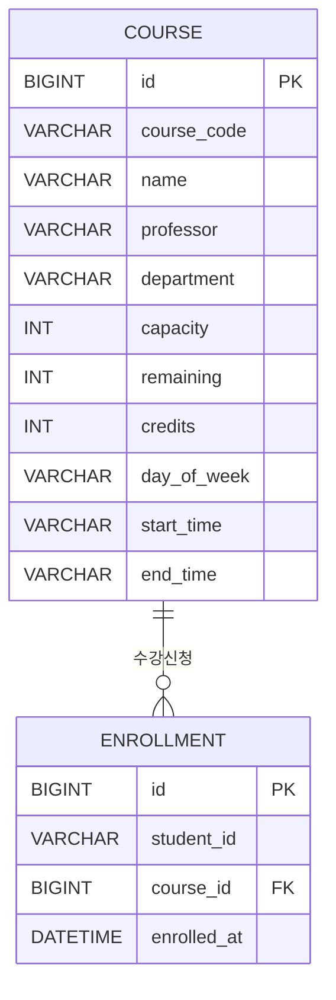

# 수강신청 시스템 ERD

```mermaid
erDiagram
    COURSE {
        BIGINT id PK
        VARCHAR course_code
        VARCHAR name
        VARCHAR professor
        VARCHAR department
        INT capacity
        INT remaining
        INT credits
        VARCHAR day_of_week
        VARCHAR start_time
        VARCHAR end_time
    }

    ENROLLMENT {
        BIGINT id PK
        VARCHAR student_id
        BIGINT course_id FK
        DATETIME enrolled_at
    }

    COURSE ||--o{ ENROLLMENT : "수강신청"
```

## 테이블 관계 설명

- **COURSE → ENROLLMENT**: 1:N 관계 (하나의 강의에 여러 학생이 수강신청)
- `enrollment.course_id`가 `course.id`를 참조
- `remaining = capacity - (해당 course_id의 enrollment 수)`로 잔여석 계산
